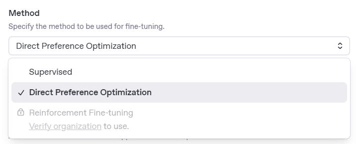

# Overview
This project builds upon the existing work [Streamlines of Otherness](https://freeradicals.io/projects/streamlines-of-otherness/) and is realized in collaboration with Joelle Bitton.
The application allows users to generate 3D printed clay objects by interacting with a Telegram chatbot.

## Table of Contents
- [Overview](#overview)
- [Technology Stack](#technology-stack)
  - [Backend](#backend)
  - [Webhook](#webhook)
  - [API Integration](#api-integration)
  - [3D Printer Communication](#3d-printer-communication)
- [3D Simulation](#3d-simulation)
- [Setup](#setup)
  - [Environment Variables](#environment-variables)
  - [Create Environment and Install Requirements](#create-environment-and-install-requirements)
- [AI Scores](#ai-scores)
  - [Supported Scores](#supported-scores)
  - [Adding Custom Scores](#adding-custom-scores)
  - [Mapping AI Scores to Printing Parameters](#mapping-ai-scores-to-printing-parameters)
- [Printing Parameters](#printing-parameters)
  - [General Settings](#general-settings)
- [Geometry Taxonomy](#geometry-taxonomy)
  - [Shape Parameters](#shape-parameters)
  - [Line Parameters](#line-parameters)
- [Telegram Bot](#telegram-bot)
  - [Fine-tune Model with Examples](#fine-tune-model-with-examples)
- [Future Work](#future-work)
  - [Multiple Users](#multiple-users)
  - [Storing Outcomes for Model Training](#storing-outcomes-for-model-training)

# Technology Stack
### Backend
Flask using SocketIO to communicate with the frontend.

### Webhook
The application receives updates from the chatbot through a webhook. When deploying the application on localhost, ngrok is used to expose the webhook.

### API Integration
For chat text classification and completion, we use the OpenAI API.  
To send text messages back to the user, we use the Telegram API.

### 3D Printer Communication
To communicate with the 3D printer, the [Printrun suite](https://github.com/kliment/Printrun) was used.

# 3D Simulation
For testing during development and documentation, you can view some of the generated 3D shapes on this website: https://spectacular-hotteok-47e6cf.netlify.app/

# Setup
### Environment Variables
1. Rename the `example_env.txt` file to `.env`.
2. Copy and paste the OpenAI API key from the project website into the `.env` file: https://platform.openai.com/settings/proj_LPoMKnZhBYYVyKUUVGr1UXAF/api-keys
3. Create a new Telegram bot or use an existing bot and copy and paste the bot token into the `.env` file: https://core.telegram.org/bots/tutorial 

### Create Environment and Install Requirements
See instructions from the previous version: [flask-socketio-printer](https://github.com/criseone/flask-socketio-printer)

### Webhook Exposure with ngrok
When running the application for the first time and trying to connect to the chatbot, an authentication error will occur. To resolve this error, an account at https://ngrok.com/ is needed.

### Changing Connection Port
The port and baud rate for connecting to the printer should be changed in the `app.py` file and in the `static/vue_instance.js` file. 

# AI Scores
The application mainly uses the OpenAI GPT-4o model for extracting pre-defined scores from text, images, and GPS locations. As of now, GPT-4o does not support audio processing; therefore, a TensorFlow model is used to extract information from audio files.

### Supported Scores
Implemented scores (excluding audio scores) are listed in the `telegram_bot/ai_scores.json` file. Each score belongs to one of two types:
- **Categorical scores:** Given a list of possible categories, the model returns the most fitting ones.
- **Numeric scores:** According to the prompt, the model assigns a float value between 0 and 1.

In addition to the described scores, the application also supports extraction of feature vectors from text (text embedding): https://platform.openai.com/docs/guides/embeddings/embedding-models

### Adding Custom Scores
*Note: At the moment, it is not possible to add custom scores for audio files.*

Modification of existing scores and adding additional custom scores should be done in the `telegram_bot/ai_scores.json` file and should follow the structure below. No additional code modification is needed. The application iterates through the JSON file and prepares the requests for the GPT-4o model in the `telegram_bot/handlers.py` file.

```json
"name of the score (unique)": {
    "description": "prompt for the model",
    "type": "categorical or numeric", // for location score, numeric is not supported
    "categories": [] // only include if type is categorical
}
```

### Mapping AI Scores to Printing Parameters
Mapping the retrieved AI scores to a shape or line parameter can be done in the `telegram_bot/parametershandler.py` file. All possible parameters are listed at the top of the file and are also further described in the Geometry Taxonomy section. When receiving messages from the user through the chatbot, the application calls a method in the `parametershandler.py` file depending on the type of the received message. Each method then calls the function to extract the AI scores and may also extract additional information about the input, for example pixel brightness for messages of type image.

Example 1: Mapping the diameter of the second center point to the pixel brightness of an image. In `set_parameters_imgInput` add:
```python
if len(self.shape_options["diameter"]) >= 2:  # Make sure we have at least 2 center points
    max_diameter = max(self.shape_options["diameter"][1][0], self.shape_options["diameter"][1][1]) + 40
    min_diameter = min(80, max_diameter) - 80
    # Helper function to map the range of brightness (0-1) to the desired range
    new_diameter = self.map_parameter_to_range(avg_brightness, min_diameter, max_diameter, 0, 1)
    self.shape_options["diameter"][1][0] = new_diameter  # Assign x-diameter of the 2nd center point
    self.shape_options["diameter"][1][1] = new_diameter  # Assign y-diameter of the 2nd center point
```

Example 2: Mapping a line pattern to the location category. In `set_parameters_locationInput` add:
```python
location_category = scores.get("location_category", "none")  # none is the default value if not found
if location_category == "urban":
    self.line_options["pattern"] = "rect"
```

### Fine-tune the Model with Scoring Examples
At the moment no integrated in the code base. The process would be similar to training the chat bot behaviour but instead of using the DPO (direct preference optimization) method I would suggest to use the reinforcement fine-tuning method.

# Printing Parameters
- **Starting height:** Can be set in the `slicerhandler.py` file at the very top.
- **E** (often referred to as extrusion rate) controls how much filament is extruded. The standard value is around 0.8; for wetter clay or when the pressure is high, use slightly higher values.
- **F** (often referred to as feed rate) controls how fast the x, y move happens, and consequently also how fast the extrusion happens. Here as well, increase slightly when the clay is wetter. A good starting value is around 1200.
- The **New/Home** button brings the printer head back to its home position and resets the layer count to 0, but does not reset any other values.
- **Max height:** Can be set in the `app.py` file at the very top. Determines the maximal height of the object to print. If the specified height is reached the printer stops. *Note: the maximal height also includes the starting heigth*

# Geometry Taxonomy
*Note: Also see the Google Sheet for reference.*

### Shape Parameters
The following parameters define the geometry and development of the base shapes during the 3D printing process. These parameters can also be found in the telegram_bot/parametershandler.py file stored in the self.shape_options dictionary for mapping them to ai scores.

- **Base Shape**  
  *(string)*  
  The primary 2D shape used as the foundation of each layer.  
  *Supported values:*  
  - `"circle"` (default)  
  - `"rectangle"`  
  - `"triangle"`  
  - `"freehand"` (custom-drawn outline)

- **Diameter**  
  *(list of [x, y] float pairs for each center point)*  
  The target dimensions of each center point’s shape in X and Y directions. These values can dynamically change over time as the shape grows.

- **Rotation**  
  *(float)*  
  The rotation applied to each layer (in degrees). Used for gradual twisting or spiraling effects across layers.

- **Center Points**  
  *(list of (x, y) float tuple)*  
  The initial coordinates for each separate center point. The lenght of the list is equal to the current number of center points.

- **Growth Directions**  
  *(list of (x, y) float tuple)*  
  The target positions each center point moves toward over time, enabling the base shapes to “drift” across the print bed. The lenght of the list is equal to the current number of center points.

- **Transition Rate**  
  *(float, usually between 0.5–2)*  
  The smoothing factor controlling how quickly diameters interpolate toward their target values.

- **Repetitions**  
  *(integer)*  
  The number of layers for which a shape is repeated before recomputation or change.

- **Free Hand Form**  
  *(list of [x, y] float pairs)*  
  Coordinates or vertecies describing a custom shape outline, only used when `base_shape` is `"freehand"`.

### Line Parameters
The following parameters define the surface texture, path variation, and dynamic qualities of the printed outline (the infill will always be a straight line). These parameters can also be found in the telegram_bot/parametershandler.py file stored in the self.line_options dictionary for mapping them to ai scores.

- **Pattern**  
  *(string)*  
  The type of line modulation applied to the outline of the shape.  
  **Supported values:**  
  - `"str"` — Straight (no modulation)  
  - `"circ"` — Looped 
  - `"rect"` — Stairs (rectangular pattern)  
  - `"tri"` — Zigzag 
  - `"wav"` — Waved (sinusoidal wave)  
  - `"nobs"` — Small weaved protrusions (knobs)

- **Amplitude**  
  *(integer)*  
  The height or depth of the line pattern. Affects the prominence of the modulation in millimeters.

- **Frequency**  
  *(integer should be 1,2,3,or 4)*  
  The number of pattern repetitions on the line. *Note: on the interface numbers are correct but in the code we reverse the numbers. That is 4 in the code corresponds to the lowest frequency and 1 to the highest*

- **Pattern Start**  
  *(int between 1-100)*  
  The start position of the pattern within each layer (as an offset along the outline).

- **Pattern Range**  
  *(int between 0-100)*  
  The portion of the outline to which the pattern is applied. The rest remains unmodulated.

- **Irregularity**  
  *(int should be -1,0 or 1)*  
  Random noise applied to the pattern’s amplitude, introducing imperfect variations. 1 applies the noise mostly on the inside and -1 on the outside.

- **Transition Rate**  
  *(float)*  
  The smoothing factor controlling how quickly the pattern interpolates between the previous and target states. *Note: there is no interpolation for the nobs pattern type. So it is advisible to first transition to a straight line before applying the nobs*

- **Glitch**  
  *(string)*  
  Whether and how to introduce unpredictable distortions (“glitches”) into the line path.  
  **Supported values:**  
  - `"none"` — No glitching  
  - `"mesh"` — Insert mesh-like distortions

### z-Plane Parameters
The following parameters define the height profile of the printed outline. These parameters can also be found in the telegram_bot/parametershandler.py file stored in the self.z_plane dictionary for mapping them to ai scores.

- **Frequency**  
 *(integer should be 1,2 or 3)*  
  The number of peaks on the line. *Note: on the interface numbers are correct but in the code we reverse the numbers. That is 3 in the code corresponds to only 1 peak* 

- **Amplitude**  
  *(integer)*  
  The height of the peak. Affects the prominence of the modulation in millimeters.

- **non Planar**  
  *(boolean)*  
  Determines whether the the frequency and amplitude of the z-plane have any effect on the print. 
  **Supported values:**  
  - `"no"` — No elvevation in the print, height within a layer stays the same.  
  - `"yes"` — height within a layer can vary according to the frequency and amplitude values.

### Example 1
<table>
  <tr>
    <td>
      
      <br/>
      
    </td>
    <td style="vertical-align:top; padding-left:20px;">
      This example demonstrates a non-planar print with (z-plane)frequency of 2. Furthermore the outline also has a rectangluar applied to it for 50% of the shape.
    </td>
  </tr>
</table>

# Telegram Bot
To improve the behavior of the chatbot, a useful technique is to fine-tune an already trained model like GPT-4o. See: https://platform.openai.com/docs/guides/fine-tuning  
This codebase includes a custom script to format your own examples into the required data format. The method we use for improving the bot's behavior is DPO (Direct Preference Optimization), which is popular for adjusting chatbot behavior as it lets us discriminate between desired and undesired responses.

### Fine-tune Model with Examples
1. Prepare a CSV file with your own conversation examples in the following format. If the `rejected` column is left blank, the script will fill the column with a generated GPT-4o response to the prompt.

| prompt                                | chosen                        | rejected                      |
|----------------------------------------|-------------------------------|-------------------------------|
| The input the model receives           | Preferred chatbot response    | Non-optimal chatbot response  |
| "initiate a conversation with the user"| "you still with me?"          | "Hello, how can I help you?"  |

2. Copy and paste your CSV file into the `telegram_bot` folder.

3. In the `telegram_bot/convert_data.py` file, specify the correct path to your CSV file at the top.

4. Now run the `convert_data.py` script. If the execution is successful, you will see a message in the terminal. The correctly formatted data is now in the `telegram_bot/structured_dpo_data.jsonl` file.

5. Head over to your OpenAI platform dashboard. On the left menu bar, navigate to "Fine-tuning". Create a new fine-tuned model and choose the DPO method. Also upload your prepared data in the same pop-up window. After creating the model, it can take a couple of hours until your model is ready.


6. After your model is done training, copy and paste the string name of your model (it should look something like this: `ft:gpt-4.1-2025-04-14:streamline:streamline-bot-17-06:BjWPLc0H`). To use your fine-tuned model in the application, paste the string in the `telegram_bot/handlers.py` file at the top. To try your model, you can also select it in the playground provided by OpenAI.

# Future Work
### Multiple Users

### Storing Outcomes for Model Training